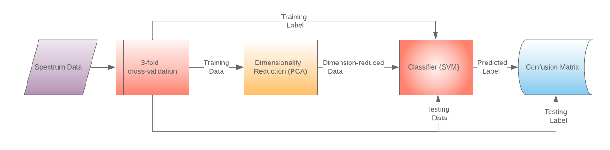

# ECE209AS_IoT
Side-channel attack using electromagnetic emanation from IoT device 
## Team Members
* Jiawei Zhang
* Zhao Lei
* Zeyu Wang

## Links
### Project Repositories
[Github](https://github.com/KyleLEI/ECE209AS_IoT "Check All Codes")
### Final Presentation Video
[Youtube](https://www.youtube.com/watch?v=0kZYEDo6shQ "Jump to Youtube")

------------------------------

## Introduction and motivation
Side-channel attacks are widely explored in the recent decades, such as power analysis and time measurement. Many investigations on electromagnetic leakage are also conducted, such as potential for attack, program profiling.
For ECE209AS course project, we reproduced the previous paper's result, and further extend scope of experiments to three different platforms. Not only analyzing the effectiveness on different platform, we are build additional machine learning model to better predict the result algorithm running and our project also handles the interrupt event as well.  
Our overall goals are:
* Measure and process the electromagnetic leakage information from different IoT processors.
* Leverage electromagnetic emanation information to deduce the algorithm currently running.
* Build and compare machine learning algorithm to classify process running.
* Expand this analyzing method to multiple platform and compare the result from different processors.

And our Specific Aims are:  
* Being able to take measurement and process spectrum information on IoT platform.
* Build execution paths with interrupts, different mathematical processes and controlled loops.
* Deduct the execution path chosen by analyzing electromagnetic information.
* Build and compare different machine learning models to perform the deduction automatically.
* Extending this method to three platforms - Raspberry Pi, STM32, and Arduino.

## Background knowledge  
### Prior work on Side-Channel attack
* EM wave will be generated because of the processor’s switching activity.
  * Processor with higher power consumption is easier to measure
  * Processor with a metal shield is almost impossible to probe
* Looping of a program will cause periodic EM wave generation.
  * Many operations will include looping of some basic function modules
* System’s optimization and interrupts will cause some volatility in the measurement result.
  * So we created machine learning models to build more robust algorithm based on the training data.
* Measurement technique is based on real-world experiments
  * Setting of spectrum analyzer determines the accuracy of dataset.
  * Placement of the probe matters.
  * Consistency in setup is important, but contrary situation can help us as well.
  

### Prior work on machine learning classifier
* Support Vector Machines (SVM)
  * A support vector machine (SVM) is a supervised machine learning model that uses classification algorithms for two-group classification problems. After giving an SVM model sets of labeled training data for either of two categories, they’re able to categorize new examples.
* Principal component analysis(PCA)
  * Principal component analysis (PCA) is a statistical procedure that uses an orthogonal transformation to convert a set of observations of possibly correlated variables into a set of values of linearly uncorrelated variables called principal components. 

## Proposed method 

### Overall process
The complete process of our methodology consists of EM measurement and data processing part. In EM measurement, we will measure the electromagnetic emanation leakage from the processor across frequency. And result data will be saved in a cvs file to be processed by our machine learning model.  

### Spectrum analyzer measurement
Taking good measurement in this experiment requires good orientation of the probe and the right setting. For different processor, we are aiming at different clock frequencies. For example, STM32 has the clock frequency of 480MHz, Arduino has the clock frequency of 16MHz and Raspberry Pi has the clock frequency of 1.5GHz. For each of them, different probe needs to be used to reduce the noise level.  
In addition orientation of the probe matters, 
### Machine learning model
#### Input data
The spectrum analyzer outputs data in the format of **(frequency,amplitude)** for each sweep. The number of frequencies available depends on the start, stop frequency, as well as the step size we select. These measurements are also ideal features for classification, in that they are mutually-exclusive and has already been transferred to the frequency domain. 

Although there are some obvious challenges we have to deal with when processing said data. We observe the data has the following properties:
 - High dimensional
 - Small number of data points

#### Classifier
The high dimensional aspect hints at a deep learning model being implemented, but the small number of samples will render deep learning ineffective. So we chose to go with a more traditional machine-learning approach. Namely first reducing the data dimension via methods such as **PCA**. Then we feed the processed data to a classifier that works well with a small dataset, a **support vector machine(SVM)**.

To further combat the dataset size problem, we decide to implement **3-fold cross validation**. This enables us to examine whether the spectrum data can be correctly classified according to the control loop it corresponds to.

As for the classification output, we have already labeled each spectrum with the **ID of the loop** the underlying processor is running. For example, 1 means the processor is running a `print` function and a floating point addition, while 2 means a floating point addition without the `print` function.

The structure of our machine-learning setup is shown below

#### Metrics
The testing accuracy is obviously a key metric in our implementation. Specifically, if, given the training data, the classifier is able to distinguish between different loops in the testing set with high accuracy, we have succeeded. But to understand what caused the inaccuracies, we can also use a **confusion matrix**. If the numbers on its diagonal are large, with others close to 0, it means the classifier classified the input into the correct categories with few mis-classifications.

### Result
The confusion matrices for each of our platform is shown below. It is quite obvious that our classifier is able to distinguish between different control loops perfectly. From this, we can deduce the execution path the program has chosen based on some secrets, and consequently extract the underlying secret. 
#### Arduino

#### STM32

#### Raspberry Pi

## Conclusion
Building upon previous work on EM emanation side-channel attacks, we implemented our own attack targeting program loopings on our own platforms. We successfully determined the program execution path based on its unintentional EM emanation. 

In addition to prior works on this subject, we built and tested a machine learning classifier to determine the loop that is producing an EM wave pattern. This would enable automated EM side-channel attacks, specifically a pipeline where the data collection, processing and classification works in tandem to automatically extract the program execution path and the corresponding secret that caused it. 

We also extended the application of such an attack on different IoT platforms including
 - Arduino, a popular IoT prototyping platform
 - STM32, a ubiquitous microcontroller in IoT
 - Raspberry Pi, a sophisticated embedded IoT computing platform

Please find our source code available at [this GitHub Repository](https://github.com/KyleLEI/ECE209AS_IoT).

---------------------------------------------
